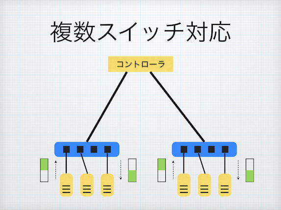

#情報ネットワーク学演習II 10/12 レポート課題
===========
学籍番号 33E16011
提出者 田中 達也

## 課題 (複数スイッチ対応版 ラーニングスイッチ)

複数スイッチに対応したラーニングスイッチ (multi_learning_switch.rb) の動作を説明しよう。

* 複数スイッチの FDB をどのように実現しているか、コードと動作を解説する
* 動作の様子やフローテーブルの内容もステップごとに確認すること
* 必要に応じて図解すること



##解答
###コード解説
[multi_learning_switch.rb](https://github.com/handai-trema/learning-switch-Tatsu-Tanaka/blob/master/multi_learning_switch.rb)のソースコードを説明する。
####startメソッド
```
  def start(_argv)
    @fdbs = {}
    logger.info "#{name} started."
  end
```
rubyでは@から始まる変数はインスタンス変数と呼ばれ、そのオブジェクトが存在する間有効である。
それぞれのスイッチに対してFDB（フォワーディングデータベース）が存在するので、インスタンス変数@fdbsをオブジェクトの集合である連想配列として初期化する。
そしてlogger.infoを用いてクラスが開始したことを示すメッセージを表記する。
####switch_readyメソッド
```
  def switch_ready(datapath_id)
    @fdbs[datapath_id] = FDB.new
  end
```
switch_readyハンドラが呼び出されたら連想配列@fdbsのキーを`datapath_id`とし、FDBオブジェクトを要素として格納する。
####packet_inメソッド
```
  def packet_in(datapath_id, packet_in)
    return if packet_in.destination_mac.reserved?
    @fdbs.fetch(datapath_id).learn(packet_in.source_mac, packet_in.in_port)
    flow_mod_and_packet_out packet_in
  end
```
packet_inハンドラが呼び出されると`packet_in.destination_mac.reserved`でなければFDBを更新する処理が行われる。
PacketInが発生したスイッチのFDBオブジェクトを参照する。
FDBは「ホストのMACアドレス」+「ポート番号」の組を保持するのものであるので、送信元のMACアドレス`packet_in.source_mac`とポート番号`packet_in.in_port`を学習する。
そして、`flow_mod_and_packet_out`メソッドを呼び出す。
####flow_mod_and_packet_outメソッド
```
  def flow_mod_and_packet_out(packet_in)
    port_no = @fdbs.fetch(packet_in.dpid).lookup(packet_in.destination_mac)
    flow_mod(packet_in, port_no) if port_no
    packet_out(packet_in, port_no || :flood)
  end
```
まず送信先にパケットを送信するためには送信先のポート番号を知る必要がある。
そこで、`port_no = @fdbs.fetch(packet_in.dpid).lookup(packet_in.destination_mac)`でFDBに保持されているMACアドレスとポート番号の組からポート番号を取得する。
このポート番号が分かった場合（FDBにMACアドレスが登録されていた場合）
flow_modメソッドによりフローテーブルの更新を行う。
またこのままではスイッチに届いたパケットが送信されないので、packet_outメソッドによりパケットを出力する。
送信先のポート番号が分かる場合はそのポート番号にパケットを送信する。
ポート番号がわからない場合、フラッディングによりパケットをばらまくようにスイッチに支持する。

#####flow_modメソッド
```
  def flow_mod(packet_in, port_no)
    send_flow_mod_add(
      packet_in.datapath_id,
      match: ExactMatch.new(packet_in),
      actions: SendOutPort.new(port_no)
    )
  end
```
flow_modメソッドによりフローテーブルの更新を行う。
FDBから取得したポート番号に対してパケットを送信するように登録する。

#####packet_outメソッド
```
  def packet_out(packet_in, port_no)
    send_packet_out(
      packet_in.datapath_id,
      packet_in: packet_in,
      actions: SendOutPort.new(port_no)
    )
  end
```
スイッチからパケットを出力するようにメッセージを送信する。
FDBから取得したポート番号に対してパケットを送信するように登録する。

###動作解説
[trema.multi.conf](https://github.com/handai-trema/learning-switch-Tatsu-Tanaka/blob/master/trema.multi.conf)で指定されているSDNの構造は、スイッチが4つ（lsw1〜lsw4）が存在し、各スイッチに対してホストが2つずつ（host1-1,host1-2,host2-1,・・・,host4-2）接続されている。
以下の動作テストを行った。
####host1-1とhost1-2の送受信
まず端末を立ち上げ、multi-learning-Tatsu-Tanakaディレクトリにおいて`./bin/trema run ./lib/multi_learning_switch.rb -c trema.multi.conf`を入力し、実行する。
別の端末を立ち上げ、パケットの送受信とスタッツとフローテーブルの確認を行う。
以下に、その時の端末の表示を示す。
```
ensyuu2@ensyuu2-VirtualBox:~/learning-switch-Tatsu-Tanaka$ ./bin/trema send_packets --source host1-1 --dest host1-2
ensyuu2@ensyuu2-VirtualBox:~/learning-switch-Tatsu-Tanaka$ ./bin/trema show_stats host1-1
Packets sent:
  192.168.0.1 -> 192.168.0.2 = 1 packet
ensyuu2@ensyuu2-VirtualBox:~/learning-switch-Tatsu-Tanaka$ ./bin/trema show_stats host1-2
Packets received:
  192.168.0.1 -> 192.168.0.2 = 1 packet
ensyuu2@ensyuu2-VirtualBox:~/learning-switch-Tatsu-Tanaka$ ./bin/trema send_packets --source host1-2 --dest host1-1
ensyuu2@ensyuu2-VirtualBox:~/learning-switch-Tatsu-Tanaka$ ./bin/trema show_stats host1-1
Packets sent:
  192.168.0.1 -> 192.168.0.2 = 1 packet
Packets received:
  192.168.0.2 -> 192.168.0.1 = 1 packet
ensyuu2@ensyuu2-VirtualBox:~/learning-switch-Tatsu-Tanaka$ ./bin/trema show_stats host1-2
Packets sent:
  192.168.0.2 -> 192.168.0.1 = 1 packet
Packets received:
  192.168.0.1 -> 192.168.0.2 = 1 packet
ensyuu2@ensyuu2-VirtualBox:~/learning-switch-Tatsu-Tanaka$ ./bin/trema dump_flows lsw1
cookie=0x0, duration=23.117s, table=0, n_packets=0, n_bytes=0, idle_age=23, priority=65535,udp,in_port=2,vlan_tci=0x0000,dl_src=4f:19:4e:57:4d:f5,dl_dst=e6:f8:4f:d8:11:c5,nw_src=192.168.0.2,nw_dst=192.168.0.1,nw_tos=0,tp_src=0,tp_dst=0 actions=output:1
```
まずhost1-1からhost1-2にパケットを送信する。
これによりコントローラにPacket Inが発生し、lsw1のFDBにhost1-1のMACアドレスとポート番号の組が保存される。
またPacket Outによりパケットがhost1-2に送信される。
`show_stats`コマンドを用いて確認するとそれぞれのホストにおいて正しく送信・受信されていることが分かる。
続いてhost1-2からhost1-1にパケットを送信する。
これによりコントローラにPacket Inが発生し、lsw1のFDBにhost1-2のMACアドレスとポート番号の組が保存される。
すでにhost1-1のポート番号は学習されFDBに保存されているので、出力ポートは決定される。
flow_modメソッドによりhost1-2からhost1-1へのパケットの出力先ポートをフローテーブルに書き込まれる。
またpacket_outメソッドによりパケットをhost1-1に送信される。
スタッツを確認すると、最初に送ったパケットと二度目に送ったパケットそれぞれが記録されていることが確認できる。
host1-1とhost1-2はスイッチlsw1に接続されているので`./bin/trema dump_flows lsw1`と入力し、lsw1のフローテーブルを確認する。
すると、host1-2からhost1-1へのフローエントリのみが登録されていることが確認でき、正常に動作していることがわかった。
続いて、再びhost1-1からhost1-2へパケットを送信し、スタッツとフローテーブルの確認を行う。
以下にその際の端末の表示を示す。
```
ensyuu2@ensyuu2-VirtualBox:~/learning-switch-Tatsu-Tanaka$ ./bin/trema send_packets --source host1-1 --dest host1-2
ensyuu2@ensyuu2-VirtualBox:~/learning-switch-Tatsu-Tanaka$ ./bin/trema show_stats host1-1
Packets sent:
  192.168.0.1 -> 192.168.0.2 = 2 packets
Packets received:
  192.168.0.2 -> 192.168.0.1 = 1 packet
ensyuu2@ensyuu2-VirtualBox:~/learning-switch-Tatsu-Tanaka$ ./bin/trema show_stats host1-2
Packets sent:
  192.168.0.2 -> 192.168.0.1 = 1 packet
Packets received:
  192.168.0.1 -> 192.168.0.2 = 2 packets
ensyuu2@ensyuu2-VirtualBox:~/learning-switch-Tatsu-Tanaka$ ./bin/trema dump_flows lsw1
cookie=0x0, duration=49.261s, table=0, n_packets=0, n_bytes=0, idle_age=49, priority=65535,udp,in_port=2,vlan_tci=0x0000,dl_src=a0:55:f7:9b:55:86,dl_dst=cf:28:57:b8:6c:61,nw_src=192.168.0.2,nw_dst=192.168.0.1,nw_tos=0,tp_src=0,tp_dst=0 actions=output:1
cookie=0x0, duration=13.474s, table=0, n_packets=0, n_bytes=0, idle_age=13, priority=65535,udp,in_port=1,vlan_tci=0x0000,dl_src=cf:28:57:b8:6c:61,dl_dst=a0:55:f7:9b:55:86,nw_src=192.168.0.1,nw_dst=192.168.0.2,nw_tos=0,tp_src=0,tp_dst=0 actions=output:2
```
host1-1からhost1-2へのフローエントリが追加されていることが確認できた。

####host2-1とhost2-2の送受信
続いてスイッチlsw2に接続されている2つのホストhost2-1とhost2-2の送受信について確認する。
以下に、実行時の端末の表示を示す。
```
ensyuu2@ensyuu2-VirtualBox:~/learning-switch-Tatsu-Tanaka$ ./bin/trema send_packets --source host2-1 --dest host2-2
ensyuu2@ensyuu2-VirtualBox:~/learning-switch-Tatsu-Tanaka$ ./bin/trema show_stats host2-1
Packets sent:
  192.168.0.3 -> 192.168.0.4 = 1 packet
ensyuu2@ensyuu2-VirtualBox:~/learning-switch-Tatsu-Tanaka$ ./bin/trema show_stats host2-2
Packets received:
  192.168.0.3 -> 192.168.0.4 = 1 packet
ensyuu2@ensyuu2-VirtualBox:~/learning-switch-Tatsu-Tanaka$ ./bin/trema send_packets --source host2-2 --dest host2-1
ensyuu2@ensyuu2-VirtualBox:~/learning-switch-Tatsu-Tanaka$ ./bin/trema show_stats host2-1
Packets sent:
  192.168.0.3 -> 192.168.0.4 = 1 packet
Packets received:
  192.168.0.4 -> 192.168.0.3 = 1 packet
ensyuu2@ensyuu2-VirtualBox:~/learning-switch-Tatsu-Tanaka$ ./bin/trema show_stats host2-2
Packets sent:
  192.168.0.4 -> 192.168.0.3 = 1 packet
Packets received:
  192.168.0.3 -> 192.168.0.4 = 1 packet
ensyuu2@ensyuu2-VirtualBox:~/learning-switch-Tatsu-Tanaka$ ./bin/trema dump_flows lsw2
cookie=0x0, duration=23.681s, table=0, n_packets=0, n_bytes=0, idle_age=23, priority=65535,udp,in_port=2,vlan_tci=0x0000,dl_src=5b:06:b7:3c:a7:73,dl_dst=43:ea:61:6d:1e:42,nw_src=192.168.0.4,nw_dst=192.168.0.3,nw_tos=0,tp_src=0,tp_dst=0 actions=output:1
ensyuu2@ensyuu2-VirtualBox:~/learning-switch-Tatsu-Tanaka$ ./bin/trema send_packets --source host2-1 --dest host2-2
ensyuu2@ensyuu2-VirtualBox:~/learning-switch-Tatsu-Tanaka$ ./bin/trema show_stats host2-1
Packets sent:
  192.168.0.3 -> 192.168.0.4 = 2 packets
Packets received:
  192.168.0.4 -> 192.168.0.3 = 1 packet
ensyuu2@ensyuu2-VirtualBox:~/learning-switch-Tatsu-Tanaka$ ./bin/trema show_stats host2-2
Packets sent:
  192.168.0.4 -> 192.168.0.3 = 1 packet
Packets received:
  192.168.0.3 -> 192.168.0.4 = 2 packets
ensyuu2@ensyuu2-VirtualBox:~/learning-switch-Tatsu-Tanaka$ ./bin/trema dump_flows lsw2
cookie=0x0, duration=16.727s, table=0, n_packets=0, n_bytes=0, idle_age=16, priority=65535,udp,in_port=1,vlan_tci=0x0000,dl_src=43:ea:61:6d:1e:42,dl_dst=5b:06:b7:3c:a7:73,nw_src=192.168.0.3,nw_dst=192.168.0.4,nw_tos=0,tp_src=0,tp_dst=0 actions=output:2
cookie=0x0, duration=48.097s, table=0, n_packets=0, n_bytes=0, idle_age=48, priority=65535,udp,in_port=2,vlan_tci=0x0000,dl_src=5b:06:b7:3c:a7:73,dl_dst=43:ea:61:6d:1e:42,nw_src=192.168.0.4,nw_dst=192.168.0.3,nw_tos=0,tp_src=0,tp_dst=0 actions=output:1
```
lsw1の時と同様の結果であることがわかり複数スイッチが正しく実装されていることを確認できた。
lsw3、lsw4の動作結果については省略する。

####host1-1とhost2-1の送受信
異なるスイッチに接続されているhost1-1とhost2-1の送受信の動作を確認する。
host2-1はスイッチlsw2に接続されており、host1-1が接続されているlsw1と、lsw2は接続されていないためパケットは転送されない。
実行した時の端末の表示を以下に示す。
```
ensyuu2@ensyuu2-VirtualBox:~/learning-switch-Tatsu-Tanaka$ ./bin/trema send_packets --source host1-1 --dest host2-1
ensyuu2@ensyuu2-VirtualBox:~/learning-switch-Tatsu-Tanaka$ ./bin/trema show_stats host1-1
Packets sent:
  192.168.0.1 -> 192.168.0.3 = 1 packet
ensyuu2@ensyuu2-VirtualBox:~/learning-switch-Tatsu-Tanaka$ ./bin/trema show_stats host2-1
ensyuu2@ensyuu2-VirtualBox:~/learning-switch-Tatsu-Tanaka$ ./bin/trema send_packets --source host2-1 --dest host1-1
ensyuu2@ensyuu2-VirtualBox:~/learning-switch-Tatsu-Tanaka$ ./bin/trema show_stats host1-1
Packets sent:
  192.168.0.1 -> 192.168.0.3 = 1 packet
ensyuu2@ensyuu2-VirtualBox:~/learning-switch-Tatsu-Tanaka$ ./bin/trema show_stats host2-1
Packets sent:
  192.168.0.3 -> 192.168.0.1 = 1 packet
```
まずhost1-1からhost2-1へパケットを送信する。
`show_stats`でスタッツを確認すると、host1-1はパケットを送信しているが、host2-1はパケットを受信していないことが確認できた。host2-1からhost1-1へパケットを送信した場合も同様の結果であった。

##参考文献
デビッド・トーマス+アンドリュー・ハント(2001)「プログラミング Ruby」ピアソン・エデュケーション.  
[テキスト: 7章 "すべての基本、ラーニングスイッチ"](http://yasuhito.github.io/trema-book/#learning_switch)


